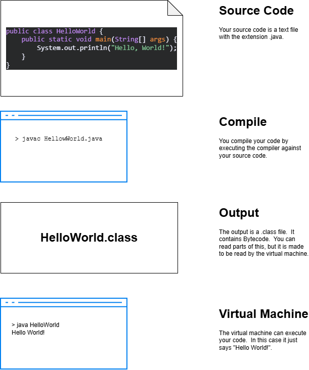

# Why Java?

Java is a popular programming language for a lot of different uses.  In this introduction, we are going to cover the basics of Java syntax so that you can explore different applications.  

Java was introduced with the idea of Write-Once-Run-Anywhere.  In some languages, e.g. C++, you have to compile your source code on every type of machine that needs to run it.  You might need to compile one for Windows, another for Mac, and a third to run on Linux desktops.  Java let's you do this once through the use of _virtual machines_.

## How does the Virtual Machine Work?



## Let's try it out

Every Java program has a *main* method.  The virtual machine, sometimes abbreviated JVM, for Java Virtual Machine, looks for this method when we tell it to run the program. 

Take a look at this example and let's walk through all of the parts.

```Java
public class MyFirstClass {
    public static void main(String[] args) {
        System.out.print("I rule!");
    }
}
```

Click [here](https://www.online-java.com/GPAz5tavhG) to see it in your browser.

Let's walk through all of the parts.

public - everyone can access it

class - let's us know we are *declaring* a class

MyFirstClass - The name of the class.  It is recommended that names of classes start with an upper case letter, and each word in the name has an upper case letter. 

{ } - The brackets define the start and end of a block of code.  
In this case, it is the start and end of the class.

static - This is a keyword we will discuss later.  For now, know that you need it for your main method.  

void - this method doesn't return anything.  We indicate that with the use of *void*.  

main - this is the name of the method.  A method is a function that belongs to a class. 

() - in a method declaration, the arguments parameters of the method go in parentheses.

String[] - this tells us the type of the method parameter.  In this case, an array of strings.  An array is similar to a list.  We will cover it in more detail later.

args - the name of the parameter for main.  args is short for arguments.  This allows us to pass in values when we run the java program. 

System.out.print - print is a function in the System.out package.  We often use print, and similar functions to output data to the terminal.  

("I rule") - we are passing the string "I rule" as a parameter to the System.out.print function.  This is what we expect to be placed on the screen.

; - Java statements end with a semicolon.